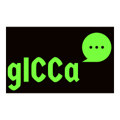

# gICCa - gICCa is an IRCCloud CLI app

This is a CLI app which uses the IRCCloud client.
Currently, the app is able to login a user and save the login credentials for future logins, send and messages to a particular messages to particular nick.

# Installation :rocket:
To use the app, enter the following commands

`git clone https://github.com/akshayaky/gICCa/`

`cd gICCa`

`go build main.go`

`./main`

# Configuration :wrench:

After  installation, add the name of the default channel in the file `defaultChan.txt`. By doing this, the first message time you send a message, it will be send the default channel.

To log out, delete the `session.txt` file which contains the session ID. The next time the app is opened, it will ask for login credentials.

# Controls :video_game:

- <kbd>Ctrl</kbd>+<kbd>F</kbd> : select the the text in the message Box as channel
- <kbd>Tab</kbd> : Navigate between the tabs
- <kbd>Enter</kbd> : send the message in message Box,  select the channel in the channel tab or memeber tab.

For the UI, I used gocui package by jroimartin, check out his repository here [https://github.com/jroimartin/gocui](https://github.com/jroimartin/gocui)
